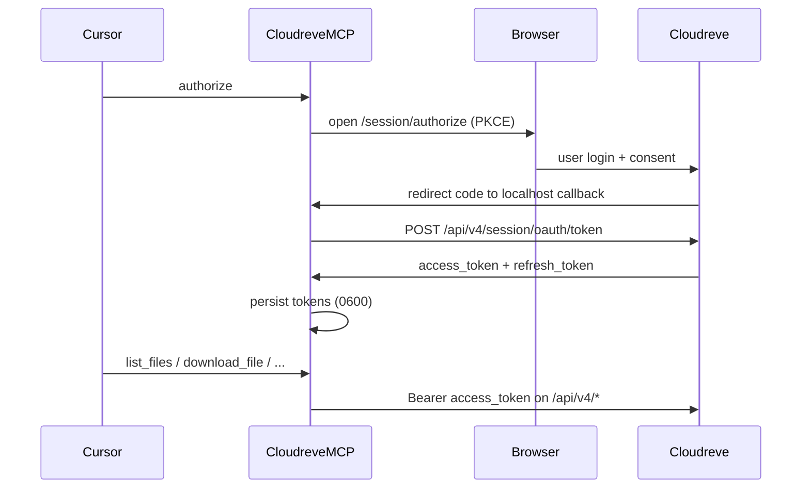

# Cloudreve v4 MCP

Standalone [Model Context Protocol](https://modelcontextprotocol.io) server for [Cloudreve](https://cloudreve.org) **v4**. It authenticates with a registered **OAuth application** (authorization code + PKCE), then exposes file and local-cache tools over **stdio** for Cursor and other MCP clients.

Not published on npm — run it with `npx` from GitHub (`github:SanderCokart/cloudreve-mcp`).

## Features

- OAuth authorize / status / logout with secure local token storage
- File tools: list, resolve id, properties, download URL, download, upload, create directory, rename, move, copy, delete, source URL, share URL
- Local cache helpers: list, write text, presign, download-to-cache, upload-from-cache
- Cloudreve v4 File URIs (`cloudreve://my/...`) with friendly `/path` inputs

## Prerequisites

1. Node.js 20+
2. A Cloudreve **v4** site (this MCP uses `/api/v4/...`)
3. An **OAuth app** created in Cloudreve admin

## Register an OAuth app

In Cloudreve admin → OAuth applications, create an app with:

| Field | Value |
| --- | --- |
| App name | e.g. `Cursor Cloudreve MCP` |
| Client secret | Generate and store securely |
| Redirect URI | `http://127.0.0.1:53682/callback` (must match `CLOUDREVE_REDIRECT_URI`) |
| Scopes | At least `openid`, `profile`, `offline_access`, plus file scopes such as `Files.Read`, `Files.Write`, `Shares.Read`, `Shares.Write` (exact names depend on your Cloudreve build) |

Copy the **Client ID** and **Client Secret**. Do not commit them to git or share them publicly.

> `offline_access` is required to receive a refresh token.

## Cursor MCP setup

Add to `~/.cursor/mcp.json` (Windows: `%USERPROFILE%\.cursor\mcp.json`):

```json
{
  "mcpServers": {
    "cloudreve": {
      "command": "npx",
      "args": [
        "-y",
        "github:SanderCokart/cloudreve-mcp"
      ],
      "env": {
        "CLOUDREVE_BASE_URL": "https://cloud.example.com",
        "CLOUDREVE_CLIENT_ID": "YOUR_CLIENT_ID",
        "CLOUDREVE_CLIENT_SECRET": "YOUR_CLIENT_SECRET",
        "CLOUDREVE_REDIRECT_URI": "http://127.0.0.1:53682/callback",
        "CLOUDREVE_SCOPES": "openid profile offline_access Files.Read Files.Write Shares.Read Shares.Write"
      }
    }
  }
}
```

Replace `https://cloud.example.com` and the OAuth placeholders with your own values. Endpoint overrides are optional; they are derived from `CLOUDREVE_BASE_URL` when omitted.

Reload MCP servers / restart Cursor, then call the **`authorize`** tool once. A browser window opens; after you approve, tokens are saved locally and other tools work.

### Run from the terminal

```bash
npx -y github:SanderCokart/cloudreve-mcp
```

Set the same environment variables as in the Cursor `env` block before running.

> Prefer `github:SanderCokart/cloudreve-mcp` over the GitHub `.tar.gz` archive URL. The archive install skips the package build on some platforms (notably Windows), so the `cloudreve-mcp` binary is missing.

## Environment

| Variable | Required | Description |
| --- | --- | --- |
| `CLOUDREVE_BASE_URL` | Yes | Your Cloudreve site, e.g. `https://cloud.example.com` |
| `CLOUDREVE_CLIENT_ID` | Yes | OAuth Client ID |
| `CLOUDREVE_CLIENT_SECRET` | Yes | OAuth Client Secret |
| `CLOUDREVE_AUTH_ENDPOINT` | No | Authorization endpoint (default: `{BASE}/session/authorize`) |
| `CLOUDREVE_TOKEN_ENDPOINT` | No | Token endpoint (default: `{BASE}/api/v4/session/oauth/token`) |
| `CLOUDREVE_REFRESH_ENDPOINT` | No | Refresh endpoint (default: `{BASE}/api/v4/session/token/refresh`) |
| `CLOUDREVE_USERINFO_ENDPOINT` | No | User-info endpoint (default: `{BASE}/api/v4/session/oauth/userinfo`) |
| `CLOUDREVE_REDIRECT_URI` | No | Default `http://127.0.0.1:53682/callback` |
| `CLOUDREVE_SCOPES` | No | Space-separated scopes (see defaults above) |
| `CLOUDREVE_DOWNLOAD_ROOT` | No | Local download root |
| `CLOUDREVE_CACHE_ROOT` | No | Local cache root |
| `CLOUDREVE_TOKEN_STORE` | No | Path to tokens JSON (mode 0600) |

Tokens are stored under the platform config dir by default:

- Windows: `%APPDATA%/cloudreve-mcp/tokens.json`
- macOS: `~/Library/Application Support/cloudreve-mcp/tokens.json`
- Linux: `~/.config/cloudreve-mcp/tokens.json`

## First-run flow



## Install from source (contributors)

```bash
git clone https://github.com/SanderCokart/cloudreve-mcp.git
cd cloudreve-mcp
npm install
npm run build
```

For local Cursor config, point `command` at `node` and `args` at the built `dist/index.js`, and set the same `env` block as above.

Copy `.env.example` for a local checklist of variables (do not commit a filled `.env`).

## Tool notes

- Paths may be `/docs/a.md` or full `cloudreve://my/docs/a.md`
- `upload_file.remote_path` must include the **filename**
- `download_file.local_path` is **relative** to `CLOUDREVE_DOWNLOAD_ROOT` and cannot escape it
- Upload supports **local** / **relay** policies fully; OneDrive and generic pre-signed chunk uploads are best-effort
- Cache tools operate only under `CLOUDREVE_CACHE_ROOT`

## Development

```bash
npm run typecheck
npm test
npm run dev
```

## License

Apache-2.0
